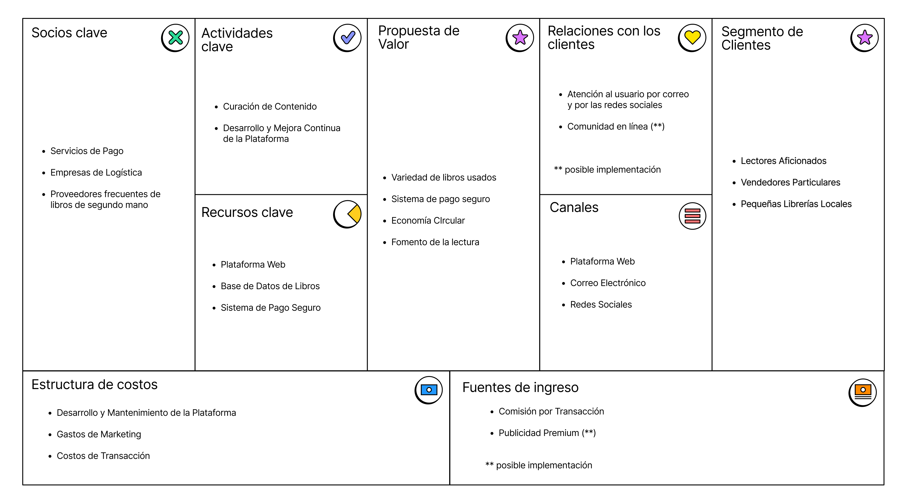
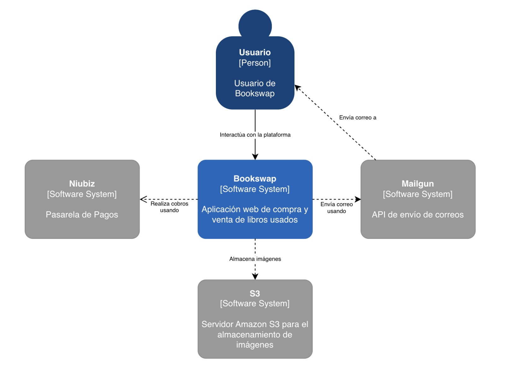

# BOOKSWAP

El objetivo de este trabajo es proponer una plataforma web para la compra y venta de libros de segunda mano en Perú. La plataforma facilitará la compra y venta de libros de segunda mano, ya que los usuarios encontrarán los libros que buscan de forma rápida y sencilla, y que ofrecería un sistema de pago seguro y confiable. Adempas, contribuiría a la economía circular. La venta de libros de segunda mano ayuda a reducir el impacto ambiental de la industria editorial, ya que evita la producción de libros nuevos. Finalmente, fomentaría la cultura de la lectura. Al hacer que los libros sean más accesibles, la plataforma podría ayudar a fomentar el hábito de la lectura entre los peruanos.

### Business Model Canvas

  

### Diagrama de Arquitectura Nivel 1

  

## Documento de Arquitectura
### [BOOKSWAP](Bookswap.md)

## Trabajos individuales I

### Brillitt Arellan 
[Data Engineering](/Anexo/Brillitt/Data%20Engineering/Data_Engineering.md)
> [Demo Data Engineering](/Anexo/Brillitt/Data%20Engineering/Demo/airflow/dags/booking_ingestion.py)

### Alexander Cruz
[NoSQL](/Anexo/Alex/NoSQL%20-%20Bases%20de%20Datos%20Orientadas%20a%20Documentos/NoSQL%20-%20Bases%20de%20Datos%20Orientadas%20a%20Documentos_AlexanderCruz.md)
> [Demo NoSQL](/Anexo/Alex/NoSQL%20-%20Bases%20de%20Datos%20Orientadas%20a%20Documentos/Demo/src/index.js)

## Trabajos individuales II

### Brillitt Arellan
[NLP](/Anexo/Brillitt/NLP/NLP.md)
> [Demo NLP](/Anexo/Brillitt/NLP/Demo/Sentiment_Analysis.ipynb)

### Alexander Cruz
[Patrón P2P](/Anexo/Alex/Patron%20P2P/PatrónPearToPear.md)
> [Demo P2P](/Anexo/Alex/Patron%20P2P/Demo/server.js)

[GeoJSON](/Anexo/Alex/GeoJSON/GEOJSON.md)
> [Demo GeoJSON](https://github.com/Alexcapo2022/GeoJson-SeguimientoPedido)

### Mauricio Micali
[Patrón Pub-Sub](/Anexo/Micali/Patron%20Pub-Sub/pubsub.md)
> [Demo Pub-Sub](https://github.com/20191288/signalr-pubsub-demo.git)

[Monitoreo de Logs](/Anexo/Micali/Monitoreo%20de%20Logs/Monitoreo%20de%20Aplicaciones.md)

> [Demo Monitoreo de Logs](/Anexo/Micali/Monitoreo%20de%20Logs/Demo/logstash.conf)

### Daniel Tello

[Seguridad en Apis](/Anexo/Daniel/Seguridad%20en%20Apis/SeguridadApis.md)
> [Demo Seguridad en APIs](/Anexo/Daniel/Seguridad%20en%20Apis/demo/src/server.js)

